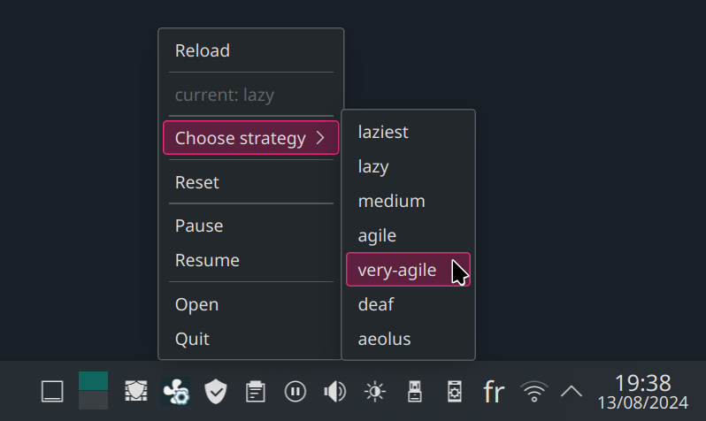

# fw-fanctrl GUI


[](https://www.python.org/downloads)

[](https://github.com/TamtamHero/fw-fanctrl)

## Description

fw-fanctrl GUI is a simple multiplatform QT6 python GUI to interact with
the [fw-fanctrl](https://github.com/TamtamHero/fw-fanctrl) CLI.

It includes a basic GUI, as well as a system tray to easily change your fan profiles on the go.



> **Important information**
>
> This project currently is in its early stage of development, is not complete yet and may be unstable or broken on
> certain platforms at any given point.
>
> Here are the currently supported features:
>
> - selecting/displaying the current strategy
> - reloading the service configuration
> - pausing/resuming the service
>
> Here is the feature plan for the foreseeable future:
>
> - single-click installation script
> - fan profile visualisation/creation/modification
> - configurable shortcuts

## Installation

### Requirements

| name   | version | url                                                                  |
|--------|---------|----------------------------------------------------------------------|
| Python | 3.12.x  | [https://www.python.org/downloads](https://www.python.org/downloads) |

### Dependencies

Before installing the GUI, make sure have installed the latest version of
the [fw-fanctrl](https://github.com/TamtamHero/fw-fanctrl) CLI.

| name                  | version | url                                                                                  |
|-----------------------|---------|--------------------------------------------------------------------------------------|
| TamtamHero@fw-fanctrl | latest  | [https://github.com/TamtamHero/fw-fanctrl](https://github.com/TamtamHero/fw-fanctrl) |

### Instructions

[Download the repo](https://github.com/leopoldhub/fw-fanctrl-gui/archive/refs/heads/master.zip) and extract it manually, or
download/clone it with the appropriate tools:

**unix**

```shell
git clone "https://github.com/leopoldhub/fw-fanctrl-gui.git"
```

```shell
curl -L "https://github.com/leopoldhub/fw-fanctrl-gui/archive/refs/heads/master.zip" -o "./fw-fanctrl-gui.zip" && unzip "./fw-fanctrl-gui.zip" -d "./fw-fanctrl-gui" && rm -rf "./fw-fanctrl-gui.zip"
```

**windows**

```shell
git clone "https://github.com/leopoldhub/fw-fanctrl-gui.git"
```

```shell
curl -L "https://github.com/leopoldhub/fw-fanctrl-gui/archive/refs/heads/master.zip" -o "./fw-fanctrl-gui.zip" && tar -xf "./fw-fanctrl-gui.zip" && del "./fw-fanctrl-gui.zip"
```

---

Then go inside the extracted folder with a terminal and install the dependencies with

```bash
pip install .
```

## Run

To run the application, use the following command

```shell
python -m src
```

Here are the additional options you can use

| Option           | Optional | Description                                                          |
|------------------|----------|----------------------------------------------------------------------|
| --background, -b | yes      | run the application in the background. does not open the main window |
