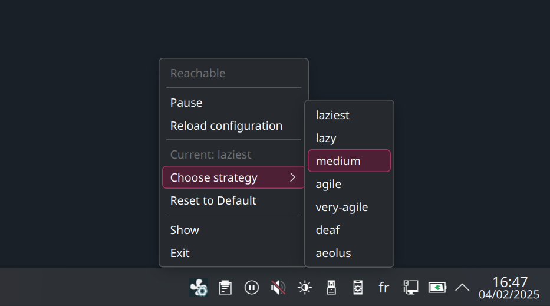

# fw-fanctrl GUI

---

# ⚠️ Reforge in progress⚠️ 

This branch is **deprecated** and **might not work properly**.

The project is being [reforged with customtkinter](https://github.com/leopoldhub/fw-fanctrl-gui/tree/customtkinter).

---


[](https://www.python.org/downloads)

[](https://github.com/TamtamHero/fw-fanctrl)

**⚠️ This version requires an experimental version of fw-fanctrl [leopoldhub/fw-fanctrl/full-api-compatibility](https://github.com/leopoldhub/fw-fanctrl/tree/full-api-compatibility) ⚠️**

## Description

fw-fanctrl GUI is a simple multiplatform customtkinter python GUI to interact with
the [fw-fanctrl](https://github.com/TamtamHero/fw-fanctrl) CLI.

It includes a basic GUI, as well as a system tray to easily change your fan profiles on the go.




> **⚠️ Important information ⚠️**
>
> This project currently is in its early stage of development, is not complete yet and may be unstable or broken on
> certain platforms at any given point.
>
> Here are the currently supported features:
>
> - System tray
> - Background launch
> - Selecting/displaying the current strategy
> - Resetting to the default strategy
> - Reloading the service configuration
> - Pausing/resuming the service
>
> Here is the feature plan for the foreseeable future:
>
> 1. **Error handling**
> 2. Selecting the default strategy
> 3. Enabling and selecting the discharging strategy
> 4. Strategy edition
> 5. Strategy creation

<!-- TOC -->
* [fw-fanctrl GUI](#fw-fanctrl-gui)
  * [Description](#description)
  * [Installation](#installation)
    * [Requirements](#requirements)
    * [Dependencies](#dependencies)
    * [Instructions](#instructions)
  * [Run](#run)
  * [Update](#update)
  * [Uninstall](#uninstall)
  * [Development Setup](#development-setup)
<!-- TOC -->

## Installation

### Requirements

| Name&nbsp;&nbsp;&nbsp;&nbsp;&nbsp;&nbsp;&nbsp;&nbsp;&nbsp;&nbsp;&nbsp;&nbsp;&nbsp;&nbsp;&nbsp;&nbsp;&nbsp;&nbsp; | Version&nbsp;&nbsp;&nbsp;&nbsp;&nbsp;&nbsp;&nbsp;&nbsp;&nbsp;&nbsp;&nbsp;&nbsp;&nbsp;&nbsp;&nbsp;&nbsp;&nbsp;&nbsp;&nbsp; | Url                                                                  |
|------------------------------------------------------------------------------------------------------------------|---------------------------------------------------------------------------------------------------------------------------|----------------------------------------------------------------------|
| Python                                                                                                           | \>= 3.12.x                                                                                                                | [https://www.python.org/downloads](https://www.python.org/downloads) |

### Dependencies

Before installing the GUI, make sure have installed the latest version of
the [fw-fanctrl](https://github.com/TamtamHero/fw-fanctrl) CLI.

| Name&nbsp;&nbsp;&nbsp;&nbsp;&nbsp;&nbsp;&nbsp;&nbsp;&nbsp;&nbsp;&nbsp;&nbsp;&nbsp;&nbsp;&nbsp;&nbsp;&nbsp;&nbsp; | Version&nbsp;&nbsp;&nbsp;&nbsp;&nbsp;&nbsp;&nbsp;&nbsp;&nbsp;&nbsp;&nbsp;&nbsp;&nbsp;&nbsp;&nbsp;&nbsp;&nbsp;&nbsp;&nbsp; | Url &nbsp;&nbsp;&nbsp;&nbsp;&nbsp;&nbsp;&nbsp;&nbsp;&nbsp;&nbsp;&nbsp;&nbsp;&nbsp;&nbsp;&nbsp;&nbsp;&nbsp;&nbsp; |
|------------------------------------------------------------------------------------------------------------------|---------------------------------------------------------------------------------------------------------------------------|------------------------------------------------------------------------------------------------------------------|
| TamtamHero@fw-fanctrl                                                                                            | \>= 1.0.1                                                                                                                 | [https://github.com/TamtamHero/fw-fanctrl](https://github.com/TamtamHero/fw-fanctrl)                             |

### Instructions

[Download the repo](https://github.com/leopoldhub/fw-fanctrl-gui/archive/refs/heads/master.zip) and extract it manually, or
download/clone it with the appropriate tools:

**unix**

```shell
git clone "https://github.com/leopoldhub/fw-fanctrl-gui.git"
```

```shell
curl -L "https://github.com/leopoldhub/fw-fanctrl-gui/archive/refs/heads/master.zip" -o "./fw-fanctrl-gui.zip" && unzip "./fw-fanctrl-gui.zip" -d "./fw-fanctrl-gui" && rm -rf "./fw-fanctrl-gui.zip"
```

Then run the installation script with administrator privileges

```bash
sudo ./install.sh
```

You can add a number of arguments to the installation command to suit your needs

| argument                                                                        | description                                                    |
|---------------------------------------------------------------------------------|----------------------------------------------------------------|
| `--dest-dir <installation destination directory (defaults to /)>`               | specify an installation destination directory                  |
| `--prefix-dir <installation prefix directory (defaults to /usr)>`               | specify an installation prefix directory                       |
| `--no-pip-install`                                                              | disable the pip installation (should be done manually instead) |


## Run

To run the application, use the following command

```shell
fw-fanctrl-gui
```

Here are the additional options you can use

| Option           | Optional | Description                                                          |
|------------------|----------|----------------------------------------------------------------------|
| --background, -b | yes      | run the application in the background. does not open the main window |


## Update

To update, you can download or pull the appropriate branch from this repository, and run the installation script again.

## Uninstall

To uninstall, run the installation script with the `--remove` argument, as well as other
corresponding [arguments if necessary](#instructions)

```bash
sudo ./install.sh --remove
```

## Development Setup

> It is recommended to use a virtual environment to install development dependencies

Install the development dependencies with the following command:

```shell
pip install -e ".[dev]"
```

The project uses the [black](https://github.com/psf/black) formatter.

Please format your contributions before commiting them.

```shell
python -m black .
```
